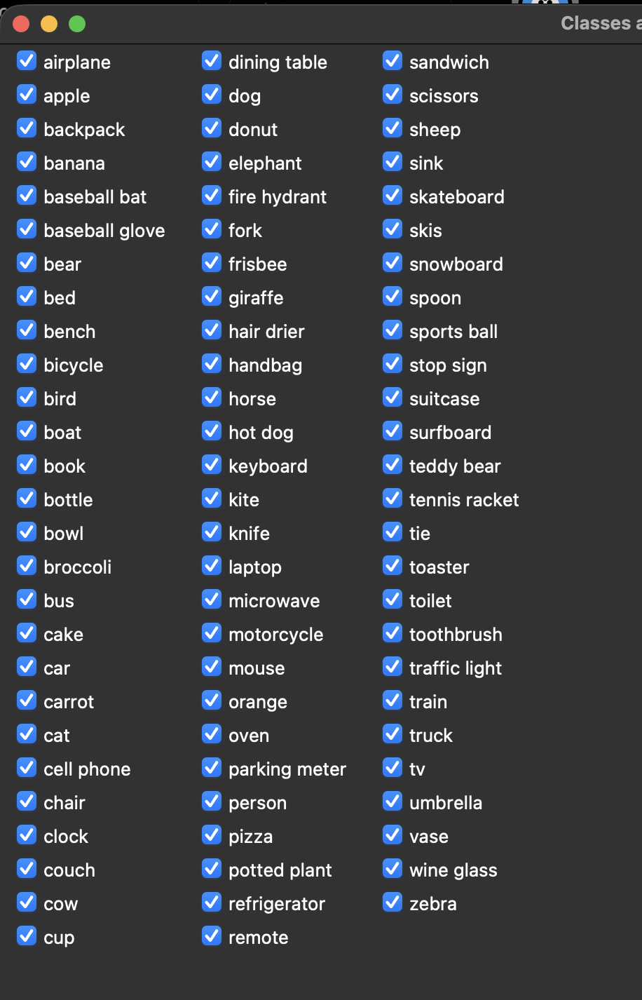

# YOLO Tracking → TouchDesigner


Real-time object/person detection, tracking and counting from a webcam ([YOLOv8](https://github.com/ultralytics/ultralytics) + ByteTrack). Sends data over OSC, e.g. to TouchDesigner.

## Features

- Source (webcam or looping video) and classifier selection panels on startup
- Tracking with persistent IDs (ByteTrack)
- Per-target state: moving (green) / stopped (red)
- Marker showing class and ID (`person ID 3`)
- Optional pose skeleton overlay, sent per keypoint over OSC
- Live FPS limit and resolution switching (default 24 FPS, 1280x720)
- Data output over OSC
- Counting line (entries / exits / inside) is currently disabled (commented out in `main.py`)

## Classifiers

Class selection panel (`Classifier Selector`):



## Requirements

- Python 3.10+
- macOS (tested) with camera permission granted to your terminal app

## Installation

```bash
python3 -m venv venv
source venv/bin/activate
pip install -r requirements.txt
```

The `yolov8n.pt` model is downloaded automatically by Ultralytics on first run.

## Usage

```bash
python main.py
```

On macOS you can also double-click `run.command`.

### Shortcuts

| Key | Action |
|-----|--------|
| `p` | Toggle pose skeleton |
| `o` | Toggle object detection |
| `c` | Reopen classifier selection panel |
| `q` / `w` | Previous / next FPS limit (12, 15, 24, 30, 60) |
| `a` / `s` | Previous / next resolution (640x360, 960x540, 1280x720, 1920x1080) |
| `Esc` | Quit |

All shortcuts are also shown in the preview window.

## Configuration

`config.json` (written when you confirm the panels):

```json
{
  "camera": 0,
  "classes": [0],
  "show_on_start": true,
  "fps": 24,
  "resolution": [1280, 720]
}
```

- `camera`: webcam index, or path to a video file (played in loop)
- `classes`: COCO class IDs (0 = person)
- `show_on_start`: show the panels on startup
- `fps`: FPS limit (updated by the `q` / `w` keys)
- `resolution`: `[width, height]` (updated by the `a` / `s` keys)

Constants at the top of `main.py`: `CONF_THRESHOLD`, `POSE_KP_CONF`, `MOVEMENT_THRESHOLD_PX`, `OSC_HOST`, `OSC_PORT`.

## OSC

Default destination: `127.0.0.1:9000`.

| Address | Value |
|---------|-------|
| `/target/<id>/class` | class name (string) |
| `/target/<id>/x`, `/y` | center, normalized 0..1 |
| `/target/<id>/w`, `/h` | size, normalized 0..1 |
| `/target/<id>/state` | 1 = moving, 0 = stopped |
| `/lost` | ID of a target that disappeared |
| `/skeleton/<id>/<keypoint>` | x, y (normalized 0..1), confidence (pose on) |

## Troubleshooting

**"Nenhuma webcam encontrada" (no webcam found)**: System Settings → Privacy & Security → Camera → enable your terminal app. If needed: `tccutil reset Camera com.apple.Terminal`.

## Credits

This integration was orchestrated by Guilherme Martins and built with [Claude Code](https://claude.com/claude-code).

Detection powered by [Ultralytics YOLO](https://github.com/ultralytics/ultralytics).
